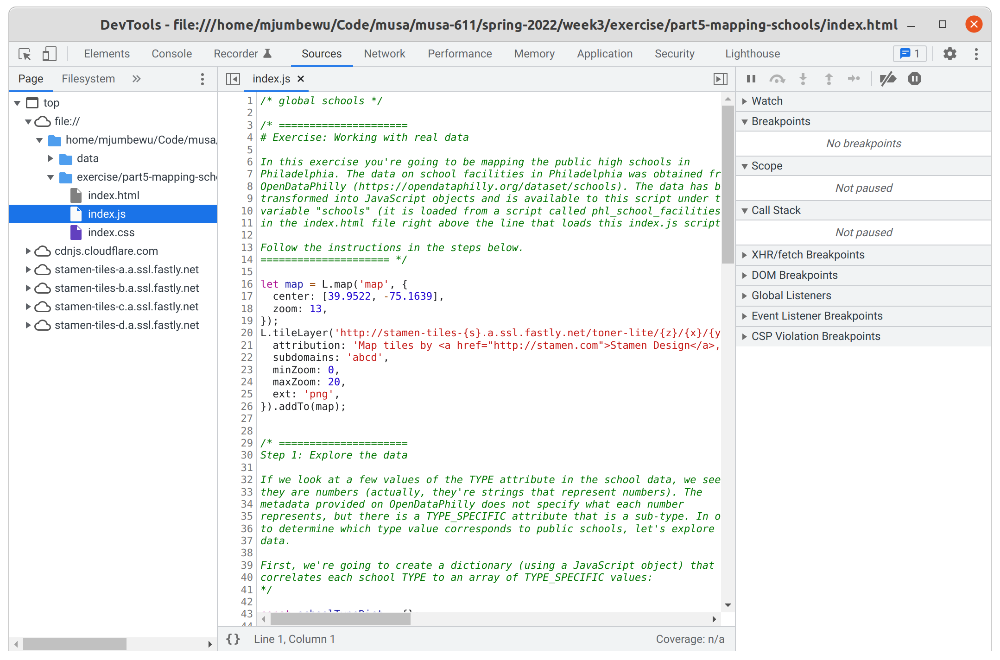
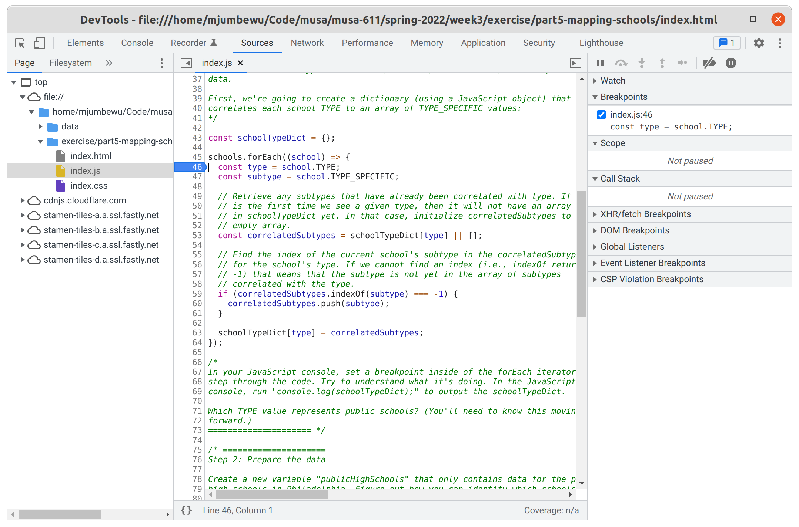
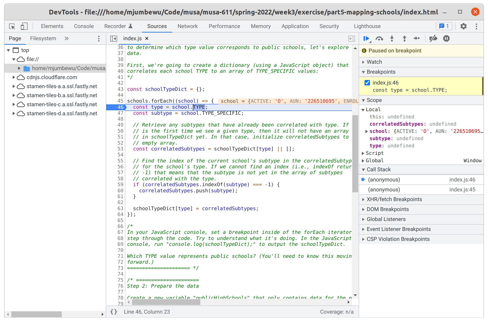
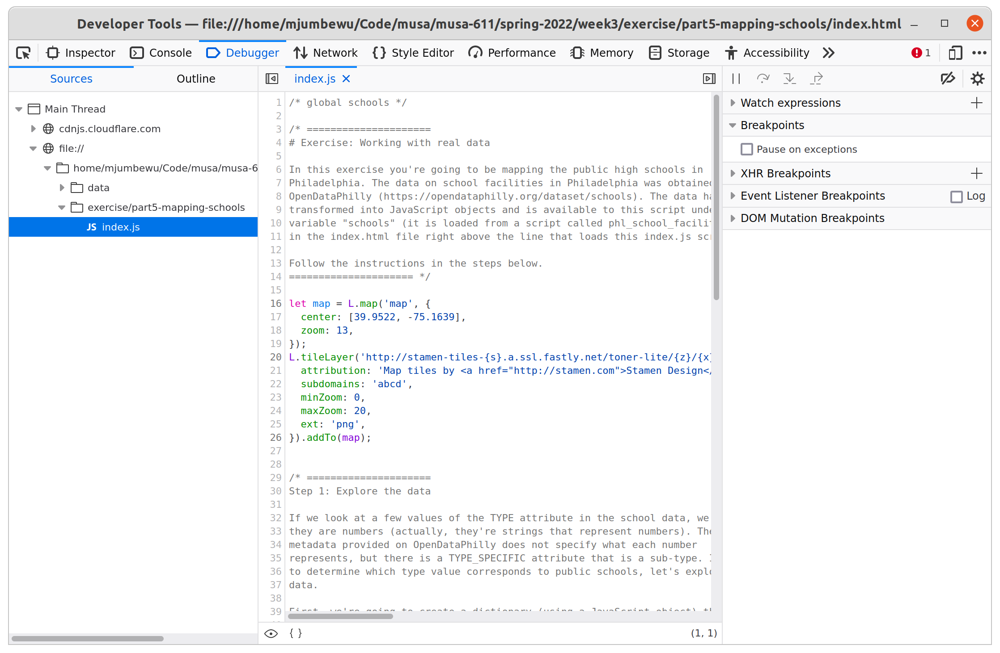
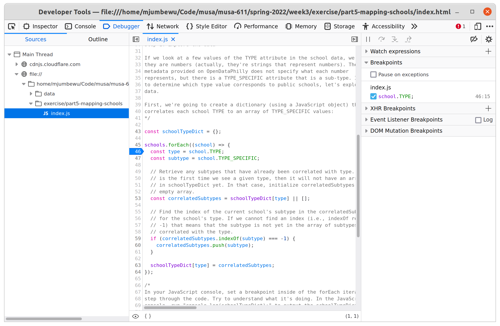
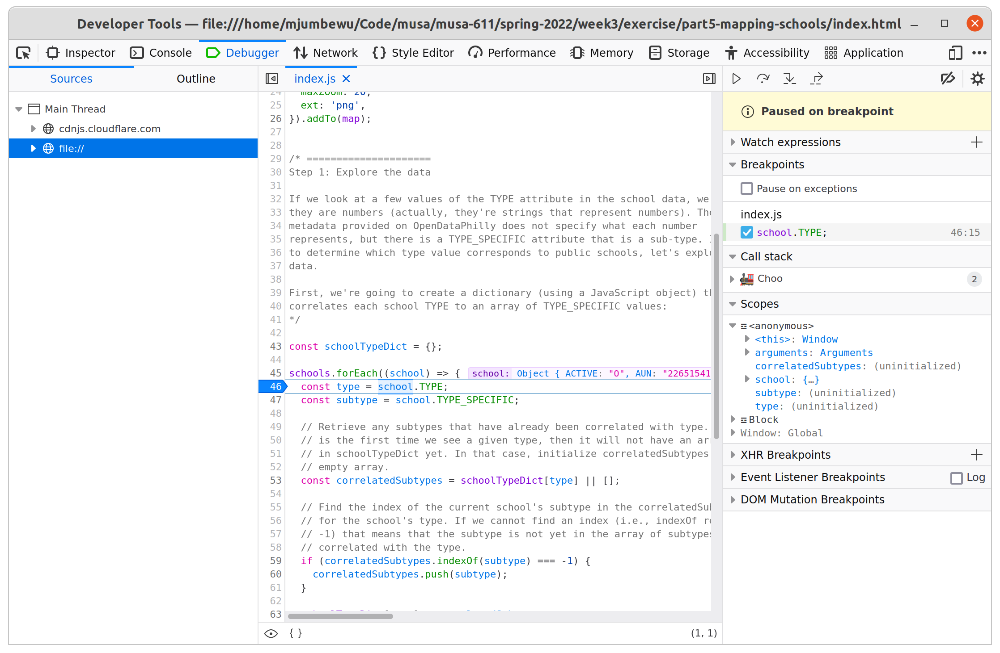

# Inspecting your code with breakpoints

In class we used the `debugger;` statement to set a breakpoint from within our
code, but many browsers have a way to set breakpoints without having to modify
your code. Below I've included screenshots on how to access this feature in
Chrome and Firefox (spoiler: the process and interface is almost identical).

## Chrome

1.  Open the developer tools (a.k.a the JavaScript console a.k.a the Inspector).
    Go to the **Sources** tab, and locate the file _index.html_ in the tree on
    the left. You should at see the code for the _index.js_ file show up in the
    center of the window.

    

2.  Scroll down to the line where you want to inspect the functionality. When
    you've located the line you want to start on, click on the line number to
    the left of the code. This will set a breakpoint at that line. The
    breakpoint will be represented by a blue arrow pointing at your code.

    

3.  Since your browser runs the code immediately when the page is loaded, the
    code will have already been executed. Thus, in order to inspect the code's
    behavior you will have to reload your page. After you reload the page, the
    browser will run code until it reaches your breakpoint, and then it will
    pause. Now you will be able to step through each line of your code.

    

    If you want to remove your breakpoint, you can click on the line number
    again and the breakpoint will be unset.

## Firefox

1.  Open the developer tools (a.k.a the JavaScript console a.k.a the Inspector).
    Go to the **Debugger** tab, and locate the file _index.html_ in the tree on
    the left. You should at see the code for the _index.js_ file show up in the
    center of the window.

    

2.  Scroll down to the line where you want to inspect the functionality. When
    you've located the line you want to start on, click on the line number to
    the left of the code. This will set a breakpoint at that line. The
    breakpoint will be represented by a blue arrow pointing at your code.

    

3.  Since your browser runs the code immediately when the page is loaded, the
    code will have already been executed. Thus, in order to inspect the code's
    behavior you will have to reload your page. After you reload the page, the
    browser will run code until it reaches your breakpoint, and then it will
    pause. Now you will be able to step through each line of your code.

    

    If you want to remove your breakpoint, you can click on the line number
    again and the breakpoint will be unset.
